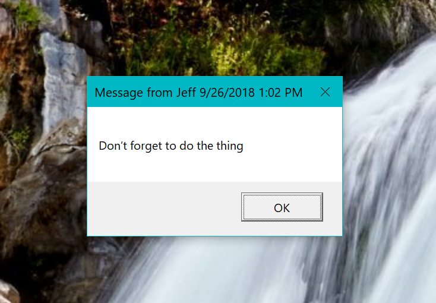

# MyReminder

This PowerShell module is an extension of scheduled jobs and is designed to display a popup reminder for the current user (you) at a given time.

You can install this module from the PowerShell Gallery:

```powershell
Install-Module MyReminder
```

You can create a scheduled reminder job to display a popup message on a variety of schedules.

```powershell
new-scheduledreminderjob -Message "Don't forget to do the thing" -Minutes 30
```



The commands in the module are wrappers for the scheduled job commands that will create and display a scheduled job reminder. The module defines an additional type name that is used with custom type and formatting extensions.

The benefit of using a scheduled job is that PowerShell does not need to be running and the reminder job will persist between sessions and reboots.

## Limitations

* This module is NOT designed to run on PowerShell Core (ie Linux or macOS). Although technically it will work on PowerShell Core on a Windows system.
* The module relies on the MSG.EXE command line tool which may not be available on server operating systems.
* The scheduled reminder is intended for the current or interactive user. This module is not designed or intended to send reminders to remote computers.

_last update 23 October 2018_
